# Cron Change Handling System

This diagram shows how the system detects and handles different types of changes to report configurations.

```mermaid
graph TB
    subgraph "Report Discovery Process"
        A[Daily Discovery Runs] --> B[Fetch Reports from Django API]
        B --> C[DynamicJobManager.detect_changes]
        C --> D{What Changed?}
    end
    
    subgraph "Change Types"
        D -->|New Reports| E[New Reports Added]
        D -->|Removed Reports| F[Reports Removed]
        D -->|Cron Changes| G[Cron Schedule Updated]
        D -->|Name Changes| H[Report Name Updated]
        D -->|No Changes| I[No Action Needed]
    end
    
    subgraph "Handling Actions"
        E --> J[🔄 Restart Required<br/>New job definitions needed]
        F --> K[🔄 Restart Required<br/>Remove job definitions]
        G --> L[✅ No Restart Needed<br/>Updated automatically]
        H --> M[✅ No Restart Needed<br/>Metadata only]
        I --> N[✅ System Up to Date]
    end
    
    subgraph "Automatic Handling"
        L --> O[Cache Updated]
        O --> P[Next Schedule/Sensor Run]
        P --> Q[Picks Up New Cron]
        Q --> R[Jobs Run on New Schedule]
    end
    
    subgraph "Manual Handling"
        J --> S[Admin Restarts Dagster]
        K --> S
        S --> T[New Job Definitions Load]
        T --> U[Individual Jobs Visible in GUI]
    end
    
    style E fill:#ffcccc
    style F fill:#ffcccc
    style G fill:#ccffcc
    style H fill:#ccffcc
    style I fill:#ccffcc
    style J fill:#ffcccc
    style K fill:#ffcccc
    style L fill:#ccffcc
    style M fill:#ccffcc
    style N fill:#ccffcc
```



## Change Detection Logic

### 1. **New Reports** (Requires Restart)
- **Detection**: Report ID exists in new data but not in cache
- **Action**: Add to cache, flag for restart
- **Reason**: New job definitions need to be loaded into Dagster

### 2. **Removed Reports** (Requires Restart)
- **Detection**: Report ID exists in cache but not in new data
- **Action**: Remove from cache, flag for restart
- **Reason**: Job definitions should be removed from Dagster

### 3. **Cron Changes** (No Restart Needed)
- **Detection**: Report exists in both, but cron expression differs
- **Action**: Update cache with new cron
- **Automatic Handling**: Next scheduler/sensor run picks up new cron from cache

### 4. **Name Changes** (No Restart Needed)
- **Detection**: Report exists in both, but name differs
- **Action**: Update cache with new name
- **Automatic Handling**: Next run uses new name in logs/metadata

## Example Scenarios

### Scenario 1: Cron Change
```
Report 1: "0 9 * * *" → "0 10 * * *"
Result: ✅ No restart needed
Next scheduler run will use 10 AM instead of 9 AM
```

### Scenario 2: New Report
```
New Report 5: "0 14 * * *"
Result: 🔄 Restart recommended
After restart: process_report_5 appears in GUI
```

### Scenario 3: Mixed Changes
```
Report 1: Cron changed "0 9 * * *" → "0 10 * * *"
Report 2: Name changed "Sales" → "Daily Sales"
New Report 3: "0 15 * * *"
Result: 🔄 Restart recommended (due to new report)
```

## Benefits

- **Intelligent Detection**: Only requires restart when absolutely necessary
- **Automatic Cron Updates**: Schedule changes are picked up automatically
- **Clear Messaging**: Logs explain exactly what changed and why
- **Minimal Disruption**: Most changes don't require server restart 