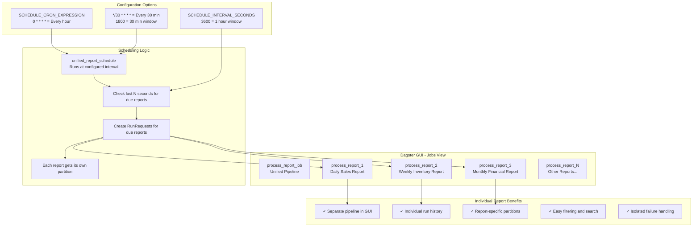

# Individual Jobs Architecture

This diagram shows how individual report jobs are created and configured in the Dagster GUI.



## Configuration Examples

### Hourly Checks (Production)
```bash
SCHEDULE_CRON_EXPRESSION=0 * * * *  # Every hour at minute 0
SCHEDULE_INTERVAL_SECONDS=3600      # 1 hour window
```

### 30-Minute Checks (Development)
```bash
SCHEDULE_CRON_EXPRESSION=*/30 * * * *  # Every 30 minutes
SCHEDULE_INTERVAL_SECONDS=1800         # 30 minute window
```

### 2-Hour Checks (Low Frequency)
```bash
SCHEDULE_CRON_EXPRESSION=0 */2 * * *  # Every 2 hours
SCHEDULE_INTERVAL_SECONDS=7200        # 2 hour window
```

## Benefits

- **Visibility**: Each report appears as its own job in the GUI
- **Isolation**: Failures in one report don't affect others
- **Searchability**: Easy to find and filter specific reports
- **Monitoring**: Individual run histories and metrics
- **Debugging**: Easier to trace issues for specific reports 