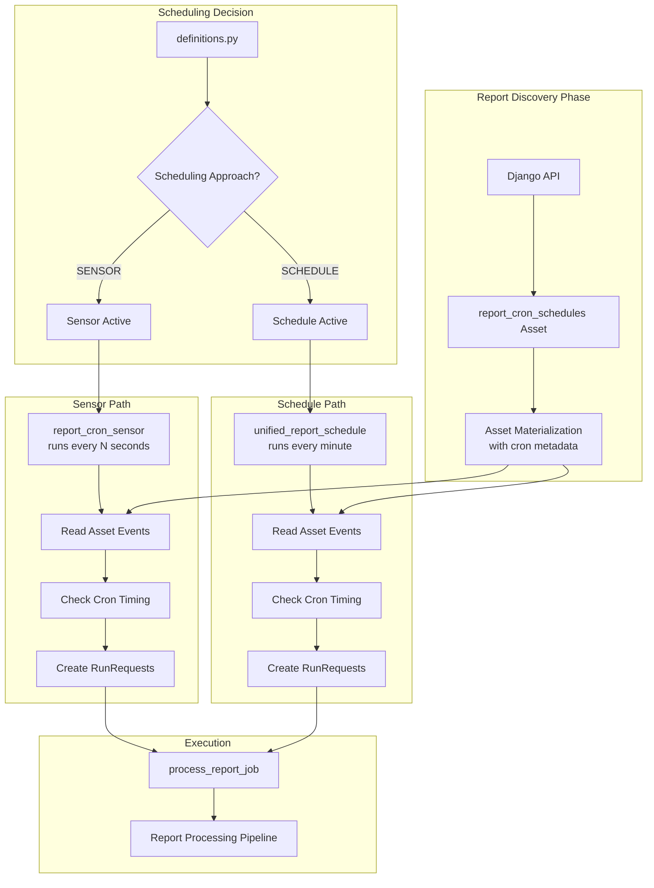

# Scheduling System Overview

This diagram shows how the report discovery, scheduling, and execution phases work together.

## Key Components

- **Report Discovery**: Daily discovery of reports and their cron schedules
- **Scheduling Decision**: Environment-based choice between sensor and schedule approaches
- **Sensor Path**: Event-driven scheduling based on asset changes
- **Schedule Path**: Time-based scheduling with configurable intervals
- **Execution**: Unified job processing pipeline 